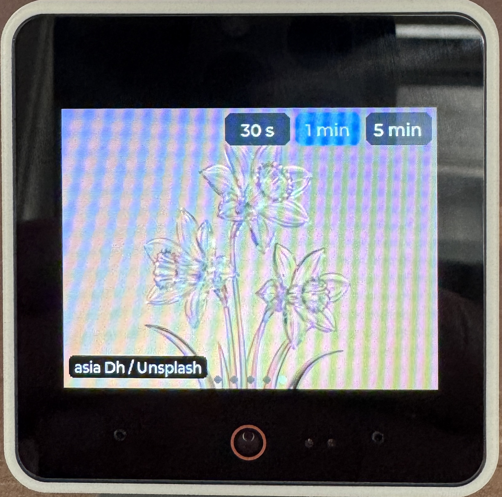
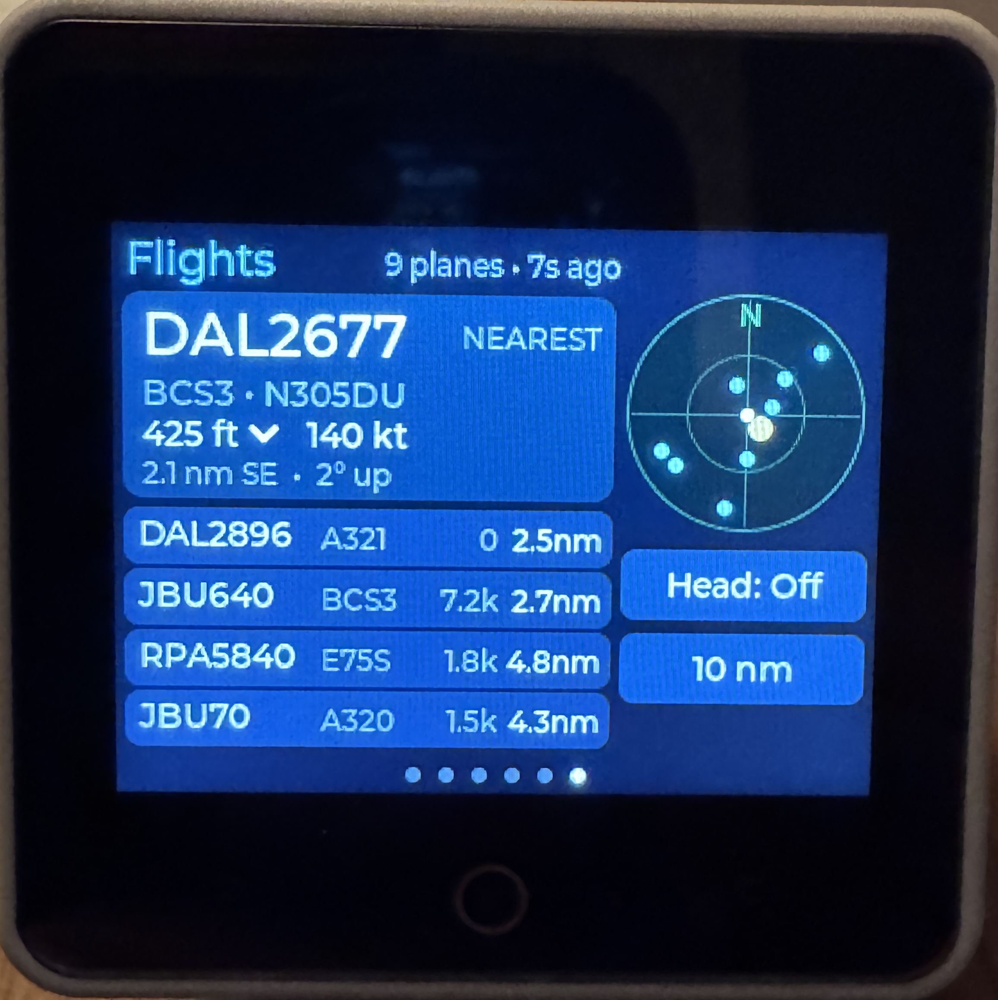

# Kitchen Sink Demo

**Kitchen Sink Demo** is a swipeable, multi-screen app for the M5Stack **StackChan**, written in MicroPython for **UIFlow2.0** with `m5ui` (LVGL 9).

Swipe **left** for the next app and **right** for the previous one. It wraps around at both ends. Dots at the bottom of the screen show which app you're on.

| # | App | What it does |
|---|-----|--------------|
| 1 | **Controls** | Six buttons: LED Green, LED Red, LED Off, Play Sound, Nod, and Take Photo (shown for 5 s) |
| 2 | **Clock + Weather** | Large clock and date, plus current conditions with drawn weather icons: temperature, high/low, feels-like, humidity, and wind |
| 3 | **Battery** | Charge gauge (estimated from voltage), voltage, current, power, charging status, and a 60-second power graph |
| 4 | **Audio** | Live microphone visuals with two modes chosen from buttons along the top: **Meter** and **Colors** |
| 5 | **Photo Frame** | Random photos from [Unsplash](https://unsplash.com), full screen, with the photographer credited. Three buttons choose how often the photo changes: **30 s**, **1 min**, or **5 min** |
| 6 | **Flights** | Planes near you from [adsb.lol](https://adsb.lol) (free, no key): a big card for the nearest plane, the next 4 in a list, and a radar. StackChan turns its head toward the plane on the card |

---

## Screen Shots

* Controls
  
* Clock
  
* Battery
  
* Audio
  
  
* Photo Frame
  
* Flights
  

## Tested on

| | |
|---|---|
| **Device** | M5Stack StackChan (CoreS3-based: ESP32-S3, 320×240 touchscreen, camera, microphone, speaker) with the StackChan robot body (pan/tilt servos, 12 RGB LEDs, INA226 battery monitor) |
| **Firmware** | UIFlow2.0 for StackChan v2.5.3, flashed with M5Burner |
| **IDE** | UiFlow2 web IDE ([uiflow2.m5stack.com](https://uiflow2.m5stack.com)), Python code view |

Kitchen Sink Demo uses the StackChan-specific `hardware.stackchan` driver. If the body isn't found at startup, the app still runs, but LEDs, servos and battery readings do nothing (see Troubleshooting).

> **Photo Frame's final design (M5GFX canvas) is not yet tested end to end.** The pieces it relies on were measured on the device (see [Photo Frame app](#photo-frame-app)); the first-run checklist there says what to watch for.
>
> **Flights is not yet tested on the device.** The adsb.lol replies it parses were captured with curl, and the parsing was checked against them on a PC. See its [first run checklist](#flights-first-run-checklist).

## Requirements

- StackChan flashed with **UIFlow2.0 for StackChan** (tested against the 2.5.x API)
- Wi-Fi configured in UIFlow2, which the clock, weather, photo frame and flights need. Controls works offline.
- Weather needs no API key. It comes from [Open-Meteo](https://open-meteo.com/), which is free and needs no signup.
- Flights needs no API key. It comes from [adsb.lol](https://adsb.lol), a free, community-run ADS-B network.
- The photo frame needs a free **Unsplash Access Key**. Sign up at [unsplash.com/developers](https://unsplash.com/developers), create an application under **Your apps**, and copy its **Access Key** (not the Secret Key). New apps are in demo mode, which allows 50 API calls per hour; the app stays well under that.

## Run it

1. Open [uiflow2.m5stack.com](https://uiflow2.m5stack.com) and connect to your StackChan.
2. Create a new project, switch to the **Python** code view, and paste in all of `kitchen-sink-demo.py`.
3. Edit the **CONFIG** section at the top (see below). For the photo frame, replace the placeholder:

   ```python
   UNSPLASH_ACCESS_KEY = "YOUR-UNSPLASH-ACCESS-KEY"
   ```

   Until you do, the Photos app shows "Set UNSPLASH_ACCESS_KEY in CONFIG" and makes no requests. Keep your real key out of the repo (for example in a `*.local.py` copy, which `.gitignore` excludes).
   For Flights, set `FACING_DEG` to the compass direction StackChan's screen faces (see [Head tracking](#head-tracking)).
4. Click **Run Once** to test. Click **Download** to make it the program that runs at boot.

## Configuration

All settings are in the `CONFIG` block at the top of the file.

| Setting | Default | Notes |
|---|---|---|
| `HOME_Y` | `20` | Tilt angle at which **your** head looks upright. Set it to the value you measured. |
| `NOD_AMOUNT` / `NOD_MOVE_MS` | `15` / `300` | Nod size in degrees and speed per leg in ms. |
| `Y_MIN` / `Y_MAX` | `5` / `85` | Safe tilt limits. Don't widen them. |
| `VOLUME` | `0.6` | Speaker volume, from 0.0 to 1.0. |
| `PHOTO_SHOW_MS` | `5000` | How long the photo stays on screen. |
| `CITY_NAME`, `LATITUDE`, `LONGITUDE` | Boston | Location used for the weather. |
| `USE_24H` | `False` | Use a 24-hour clock instead of 12-hour with AM/PM. |
| `TEMP_UNIT` / `WIND_UNIT` | `fahrenheit` / `mph` | `celsius`; `kmh`, `ms`, `kn` |
| `WEATHER_REFRESH_MS` | 15 min | How often the weather updates. |
| `BATTERY_UPDATE_MS` | `1000` | How often the battery screen refreshes. |
| `POWER_HISTORY_POINTS` | `60` | Number of points in the power graph (one per update). |
| `AUDIO_RATE` / `AUDIO_CHUNK` | `16000` / `512` | Mic sample rate, and samples per frame (32 ms). |
| `MIC_GAIN_DB` | `0` | Offset added to the meter reading. Raise it if the meter reads low. |
| `METER_FLOOR_DB` | `-60` | Quietest level shown on the meter. |
| `AUDIO_MIN_FRAME_MS` | `(0, 60)` | Minimum time between redraws for Meter and Colors. |
| `SPECTRUM_LOW_HZ` / `SPECTRUM_HIGH_HZ` | `80` / `6000` | Frequency range of the 12 color bars. |
| `SPECTRUM_RANGE` | `3.5` | Dynamic range of the bars. Lower it for more movement, raise it for less. |
| `SPECTRUM_MIN_REF` | `9.5` | Noise gate for the bars. Raise it if they dance in a quiet room. |
| `LED_BRIGHTNESS` | `0.5` | Brightness of the LEDs in Colors mode. |
| `UNSPLASH_ACCESS_KEY` | `YOUR-UNSPLASH-ACCESS-KEY` | **Required for Photos.** Your Unsplash Access Key, sent as `Authorization: Client-ID ...`. |
| `UNSPLASH_QUERY` | `""` | Limit photos to a search term, e.g. `"nature"` or `"boston"`. Empty means any photo. |
| `UNSPLASH_ORIENTATION` | `landscape` | `landscape`, `portrait`, `squarish`, or `""`. Landscape crops best to the 320×240 screen. |
| `UNSPLASH_CONTENT_FILTER` | `high` | Unsplash's safe-content filter. `high` is the strictest. |
| `PHOTO_BATCH` | `10` | Photos fetched per API call (1–30). See [Staying under the rate limit](#staying-under-the-rate-limit). |
| `PHOTO_URL_FIELD` | `("urls", "raw")` | Which URL in each photo record to display. |
| `PHOTO_SIZE_PARAMS` | `w=320&h=240&fit=crop&crop=entropy&fm=png` | Resize parameters appended to that URL, so Unsplash sends a screen-sized **PNG**. Don't switch to `fm=jpg`: Unsplash's JPEGs are progressive and won't decode. |
| `PHOTO_INTERVALS` | 30 s / 1 min / 5 min | Button labels and times. Change them freely; three buttons fit across the top right. |
| `PHOTO_DEFAULT_INTERVAL` | `1` | Which interval is selected at startup (index into `PHOTO_INTERVALS`; 1 = "1 min"). |
| `PHOTO_RETRY_MS` / `PHOTO_RATE_LIMIT_RETRY_MS` | 60 s / 10 min | Wait after an error, and after hitting the Unsplash rate limit. |
| `PHOTO_REPUSH_MS` | `5000` | How often the photo is copied to the screen again, in case something drew over it. |
| `FLIGHT_LAT` / `FLIGHT_LON` | `LATITUDE` / `LONGITUDE` | Where you are. Defaults to the weather location. |
| `FLIGHT_HOME_ELEV_FT` | `30` | Your ground elevation in feet, used for the "degrees up" angle. |
| `FLIGHT_RANGES_NM` | `(5, 10, 25)` | Search radii in nautical miles that the **Range** button cycles through (the API allows up to 250). |
| `FLIGHT_DEFAULT_RANGE` | `1` | Range selected at startup (index into `FLIGHT_RANGES_NM`; 1 = 10 nm). |
| `FLIGHT_REFRESH_MS` | 15 s | How often adsb.lol is asked, only while Flights is on screen. |
| `FLIGHT_RETRY_MS` / `FLIGHT_RATE_LIMIT_RETRY_MS` | 30 s / 2 min | Wait after an error, and after HTTP 429. |
| `FLIGHT_SHOW_GROUND` | `False` | `True` includes taxiing and parked aircraft. Ground vehicles (categories C1–C3) are always hidden. |
| `FLIGHT_MAX_AGE_S` | `60` | Ignore aircraft whose last position is older than this. |
| `FLIGHT_UI_UPDATE_MS` | `1000` | How often positions are moved forward and redrawn between fetches. |
| `FLIGHT_NEW_PLANE_LED` / `FLIGHT_EMERGENCY_LED` | blue / red | LED blink when a new plane enters range, or when one squawks 7500/7600/7700. `0` turns a blink off. |
| `FLIGHT_LED_BLINK_MS` | `400` | Length of the blink. |
| `FLIGHT_HTTP_CLIENT` | `"socket"` | `"socket"` = own HTTP/1.1 client; `"requests"` = the firmware library. |
| `HTTP_TIMEOUT_S` | `10` | Socket timeout for the HTTP/1.1 client. |
| `HEAD_TRACK_DEFAULT` | `True` | Whether **Head** starts On. |
| `FACING_DEG` | `0` | Compass direction StackChan's **screen** faces when the head is at pan 0 (0 = north, 90 = east). |
| `HEAD_PAN_SIGN` | `1` | Set to `-1` if the head turns the wrong way. |
| `HEAD_PAN_LIMIT` | `120` | Largest pan used for tracking (the servo allows 135). |
| `HEAD_TILT_SCALE` / `HEAD_TILT_MAX` | `1.0` / `75` | Tilt servo degrees per degree of elevation, and the highest tilt used. Tilt is also kept inside `Y_MIN`..`Y_MAX`. |
| `HEAD_MIN_MOVE_DEG` / `HEAD_MOVE_MS` | `3` / `800` | Ignore smaller changes (less servo chatter), and servo move time. |
| `BODY_INIT_TRIES` / `BODY_INIT_WAIT_MS` | `6` / `500` | How many times to look for the StackChan body at startup, and the wait between tries. At power-up the body can be slow to appear. |
| `SWIPE_ANIM_MS` | `250` | Length of the slide animation between apps. |

---

## How it's built

```
AppManager                      owns hardware, pages, swipe navigation, main loop
 ├─ ControlsApp(App)            app 1
 ├─ ClockWeatherApp(App)        app 2
 ├─ BatteryApp(App)             app 3
 ├─ AudioApp(App)               app 4
 ├─ PhotoFrameApp(App)          app 5
 ├─ FlightTrackerApp(App)       app 6
 └─ ...your apps(App)           add to the APPS list
```

### The `App` base class

Each screen is a class that extends `App`. The manager calls these methods:

| Method | When | Use it for |
|---|---|---|
| `build(page)` | Once, at startup | Create widgets on `page` |
| `on_enter()` | Each time the app becomes visible | Start things, force a redraw |
| `tick()` | Every loop pass (~10 ms) while visible | Quick periodic work. Don't block here. |
| `on_exit()` | Each time you swipe away | Stop things, turn LEDs off |

Apps get shared resources through the manager:

- `self.sc`: the `StackChan` hardware object (servos, LEDs, touch, NFC, battery)
- `self.mgr.run_later(fn)`: runs `fn` from the main loop instead of inside an LVGL callback. Use it for anything that sleeps or blocks, such as sounds, servo moves, the camera, or network calls.

### How swipes work

Each page listens for LVGL's `GESTURE` event. The callback only records the direction in `self.nav`, and the main loop does the actual switch with `lv.screen_load_anim(... MOVE_LEFT / MOVE_RIGHT ...)`. Scrolling is turned off on every page, because a scrollable page would swallow the swipe. Buttons have `GESTURE_BUBBLE` set, so a swipe that starts on a button still reaches the page. A quick tap on a button is still a click.

### How the clock stays correct

1. On the first weather fetch, the app attempts one NTP sync, which sets the RTC to UTC.
2. Open-Meteo returns `utc_offset_seconds` for your location, including daylight saving time. Local time is calculated as `UTC + offset`, so no timezone setup is needed.
3. As a safety net, it compares its time against Open-Meteo's reported local time. If the two differ by more than 20 minutes, it corrects itself. This covers an RTC that was never set or was set to the wrong timezone.

Before the first successful fetch, the clock shows the firmware's `time.localtime()`.

### Weather icons

The icons are drawn with LVGL shapes (circles and rounded rectangles) inside a 96×96 box, so no image files need to be uploaded. The icon kinds are clear (sun, or moon at night), partly cloudy, cloudy, rain, snow, thunderstorm, and fog. Open-Meteo's WMO `weather_code` is mapped to an icon and a description in `classify_weather()`. The background gradient also changes between day and night.

### Battery app

- Voltage, current, and power come from the StackChan body's INA226 battery monitor (`get_battery_voltage/current/power()`).
- The gauge percentage is **estimated** from voltage using a typical LiPo discharge curve (`LIPO_CURVE`). Voltage drops while the servos are moving, so the reading can dip temporarily.
- The "Charging / On battery • Core NN%" line comes from the CoreS3 power manager (`Power.isCharging()` / `Power.getBatteryLevel()`). It's left blank if your firmware doesn't expose those functions.
- The graph shows the absolute power draw over the last 60 s and rescales itself automatically.

### Audio app

The **CoreS3 microphone and speaker share one I2S bus**, so they can't run at the same time. The Audio app calls `Speaker.end()` + `Mic.begin()` in `on_enter()` and `Mic.end()` + `Speaker.begin()` in `on_exit()`. Any future app that uses the mic should follow the same pattern.

Recording uses two buffers in turn. `Mic.record()` fills one buffer in the background while the app draws the previous one.

**Frame pacing.** Drawing can take longer than the 32 ms it takes to fill a mic buffer. If the app redrew every buffer, the loop would spend all its time drawing, and touches and swipes would be missed. So after each redraw, the app waits at least `AUDIO_MIN_FRAME_MS` for that mode, and at least as long as the redraw took, before drawing again. The mic keeps recording the whole time. The mode buttons react on **press** rather than click, so a tap registers even while the loop is busy.

An oscilloscope mode was tried and removed. Redrawing a full LVGL line chart many times a second was too slow on this hardware and made the app unresponsive.

| Mode | How it works |
|---|---|
| **Meter** | RMS level in dBFS (DC offset removed). It drives 24 LED-style segments (green, yellow, red) with a slowly falling peak-hold marker, plus a large dB readout and the session max. |
| **Colors** | 12 frequency bands (80 Hz–6 kHz, log-spaced), computed with the Goertzel algorithm. The rainbow bars have falling peak caps, and a glow circle behind them pulses with loudness and cycles its color. StackChan's 12 LEDs light up to match: one LED per band, with brightness set by that band's level. |

The LEDs turn off when you switch away from Colors mode or leave the app.

### Photo Frame app

The Photos app shows a random Unsplash photo full screen and changes it on a timer. The three buttons at the top right (**30 s**, **1 min**, **5 min**) choose the interval; the selected one is blue. The photographer's name and "Unsplash" appear at the bottom left, which Unsplash's API guidelines require. The photo only changes while the app is on screen, so it doesn't use API calls in the background.

Unlike the other apps, **Photos draws with M5GFX (`M5.Lcd`), not LVGL.** The next section explains why.

#### Why not LVGL (what the device tests showed)

The first version showed the photo with m5ui's `M5Image`. It displayed nothing but a blue screen. A series of test programs on the device found three problems:

| Test | Result |
|---|---|
| Unsplash JPEG with `fm=jpg` | Unsplash sends a **progressive** JPEG. LVGL's decoder (TJpgDec) only reads baseline JPEGs, so decoding failed (image size 0 × 0). |
| Same photo as PNG (`fm=png`) through LVGL | Decoded correctly, but **one full-screen redraw took about 54 seconds**. |
| `lv.image_cache_resize()` | **Not available** in this firmware. With no image cache, LVGL decodes the whole image again on every redraw, and it redraws in strips. Even a 32 × 32 JPEG took about 450 ms per full redraw. |
| Same PNG with M5GFX `M5.Lcd.drawPng()` | **About 250 ms.** |

So the app downloads the photo as PNG and uses M5GFX to decode it.

#### How it draws

1. `build()` creates one off-screen canvas, `M5.Lcd.newCanvas(320, 240, 16, True)`, which is 150 KB in PSRAM.
2. When a new photo arrives, `compose()` decodes the PNG bytes onto the canvas with `canvas.drawPng(png_bytes, 0, 0)`. `drawPng` accepts the data directly, so **nothing is written to flash**. Then it draws the interval buttons, the credit, any status message, and the page dots on top.
3. `repaint()` copies the canvas to the screen with `canvas.push(0, 0)`, which takes about 30 ms. It first calls `lv.refr_now()` so that LVGL finishes any pending drawing and doesn't paint over the photo afterwards.

When you swipe to Photos, LVGL slides in the page, which is empty except for its page dots. The app then pushes the canvas once the slide animation has finished. It also pushes the canvas again every `PHOTO_REPUSH_MS` (5 s) in case anything drew over it. Pushing identical pixels isn't visible.

Changing the interval re-composes the canvas, which decodes the PNG again (about 250 ms). The PNG bytes of the current photo stay in memory for this.

#### How taps and swipes work on this page

The buttons are drawn pixels, not LVGL widgets, because anything LVGL draws would cover the photo. The first try read taps with `M5.Touch`, but it never saw them while m5ui was running (LVGL reads the touchscreen on its own timer). So the app listens to the page's own LVGL events instead:

- `PRESSED` records where the finger went down, using `lv.indev_active().get_point()`.
- `PRESSING` marks the touch as a swipe once it moves more than 15 px, and so does a `GESTURE` event.
- `RELEASED` without movement counts as a tap. The callback only stores the position; `tick()` then checks whether it hit a button and redraws. Redrawing isn't done inside the LVGL callback.

Each tap prints `Photos: tap at X Y` to the console. Swipes work the same as in every other app.

M5Stack advises against mixing M5GFX and LVGL on the same screen. It's contained here: on this page LVGL only draws the empty page during the slide animation, and all visible pixels come from the canvas. The Controls app's photo does something similar.

#### Each photo change, step by step

1. If the queue of unseen photos is empty, call `GET https://api.unsplash.com/photos/random?count=10&content_filter=high&orientation=landscape` with the header `Authorization: Client-ID <key>`. With `count`, the reply is a JSON **array** of photo records (the app also accepts a single object).
2. Take the next photo from the queue and download it from `images.unsplash.com` as a 320×240 PNG (about 70–100 KB).
3. Decode it onto the canvas and push it to the screen. If the download fails, the previous photo stays on screen.

**Which image is shown.** Each photo record has several URLs. `profile_image.small` is the photographer's 32×32 avatar, not the photo, so the app uses `urls.raw` and appends `PHOTO_SIZE_PARAMS`. Unsplash's image CDN then returns the photo cropped to exactly 320×240, around its most interesting area.

Fields the app reads from each record:

```json
{
  "urls": { "raw": "https://images.unsplash.com/photo-...?ixid=...&ixlib=rb-4.1.0" },
  "user": { "name": "T Y" }
}
```

On startup, the app deletes any `unsplash_*.jpg` / `unsplash_*.png` files left in `/flash/res/img` by the earlier version and by the test programs.

#### Staying under the rate limit

Demo Unsplash keys allow **50 API calls per hour**. Only `api.unsplash.com` calls count; downloading images from `images.unsplash.com` doesn't. Fetching `PHOTO_BATCH` photos per call keeps usage low:

| Interval | Photos per hour | API calls per hour (`PHOTO_BATCH = 10`) |
|---|---|---|
| 30 s | 120 | 12 |
| 1 min | 60 | 6 |
| 5 min | 12 | ~1–2 |

If the limit is hit anyway (for example, several devices sharing one key), Unsplash answers `403 Rate Limit Exceeded`. The app keeps the current photo, shows "Rate limit reached, waiting", and tries again after `PHOTO_RATE_LIMIT_RETRY_MS`.

#### First run checklist

- **Console:** look for `Unsplash: got 10 photos`, then `Photo shown (NNNNN bytes, compose+push NNN ms)`. The time should be around 300 ms.
- **Buttons:** tapping 30 s / 1 min / 5 min should print `Photos: tap at X Y` and move the blue highlight within about a quarter of a second. The buttons are at the top right, roughly x 140–316 and y 4–32.
- **Swipes:** swiping left or right on the photo should still change apps. After you swipe back to Photos, the photo should reappear about a quarter-second after the slide ends.
- **Black patches or a blank page:** if these appear over the photo, LVGL drew over it. It should fix itself within `PHOTO_REPUSH_MS`. If it doesn't, check the console.

### Flights app

Flights shows aircraft near you using [adsb.lol](https://adsb.lol), a free, community-run ADS-B network that needs no API key.

| Area | What it shows |
|---|---|
| Top bar | Number of planes and how long ago the data was fetched, or an error |
| Big card | The nearest plane: callsign, aircraft type and registration, altitude with a climb/descent arrow, ground speed, distance and compass direction, and how many degrees above the horizon it is. The tag at top right says **NEAREST**, **TRACKING** (a plane you picked) or **SQUAWK 7700** (emergency, in red) |
| List | The next 4 nearest planes: callsign, type, altitude (`8.4k`, `GND`), distance |
| Radar | North-up, with you in the middle. The outer ring is the selected range, the inner ring half of it. The card's plane is the large yellow dot; planes beyond the ring are pinned to its edge |
| **Head** button | Turns head tracking on or off |
| **Range** button | Cycles 5 / 10 / 25 nm and fetches again right away |

**Tap a list row** to put that plane on the card and track it. **Tap the card** to go back to following the nearest plane. If the tracked plane leaves the area, the card goes back to the nearest one. Rows, the card and the buttons react on a short click, so a swipe that starts on them still changes apps.

The LEDs blink blue when a new plane enters range, and red when any plane squawks an emergency code.

#### The API

```
GET https://api.adsb.lol/v2/point/{lat}/{lon}/{radius_nm}
```

Replies captured with curl:

| Case | Reply |
|---|---|
| Normal | `200`, `{"ac":[{...}, ...], "msg":"No error", "now":..., "total":19}` (10 nm over Boston: 19 aircraft, about 8 KB) |
| Nothing in range | `200`, `{"ac":[], "msg":"No error", "total":0}` |
| Bad coordinates | `400` with an empty body |

Fields the app reads from each aircraft:

```
{"hex":"a81abe", "flight":"JBU516  ", "r":"N621JB", "t":"A320",
 "alt_baro":8350, "alt_geom":8600, "gs":290.4, "track":105.38, "baro_rate":-640,
 "squawk":"4161", "emergency":"none", "category":"A3",
 "lat":42.464486, "lon":-71.171605, "seen_pos":0.026}
```

Things to know about the data:

- `alt_baro` is the string `"ground"` for aircraft on the ground, which then have no `alt_geom`. Ground aircraft are hidden unless `FLIGHT_SHOW_GROUND` is `True`.
- Airport ground vehicles appear too (for example `BOSSQD1`, category `C1`). Categories starting with `C` are always hidden.
- `flight` is padded with spaces, and is sometimes `"00000000"`. The app then shows the registration (`r`) or the hex code instead.
- The reply also has `dst` and `dir` (distance and bearing from the query point). The app computes these itself from `lat`/`lon`, because it needs east/north offsets for the radar and for dead reckoning anyway. The two agree to within 0.01 nm on the captured data.

Each reply is reduced to a small dict per plane right away, and the raw JSON is dropped. The request uses the same HTTP/1.1-over-TLS socket client as the MBTA and Stock Watchlist apps (`http11_get`).

#### Dead reckoning

The app fetches every 15 s, but a jet at 300 kt moves about 1.2 nm in that time. So between fetches, once a second, each plane is moved forward from its last reported position along its `track` at its ground speed (`gs`), and its altitude changes by its vertical rate. The time used includes `seen_pos`, the age of the position when the reply was made. Positions are never extrapolated more than 90 s. This keeps the distances, the radar and the head moving smoothly.

#### Head tracking

The head points at the plane on the card:

- **Pan:** the plane's compass bearing minus `FACING_DEG`, limited to ±`HEAD_PAN_LIMIT`. For a plane behind StackChan, the head turns as far as it can toward that side.
- **Tilt:** `HOME_Y` plus the plane's elevation angle times `HEAD_TILT_SCALE`, capped at `HEAD_TILT_MAX` and kept inside `Y_MIN`..`Y_MAX`.

The servos only move when the target changes by at least `HEAD_MIN_MOVE_DEG`. The head goes back to `HOME_X` / `HOME_Y` when you turn **Head** off, when no plane is in range, and when you swipe away.

To set it up:

1. Find which way StackChan's **screen** faces with a phone compass (stand behind StackChan and point the phone the way the screen faces). Put that bearing in `FACING_DEG`.
2. Run the app and pick a plane that is clearly to one side. If the head turns away from it, set `HEAD_PAN_SIGN = -1`.
3. If a high plane makes the head look too high or too low, adjust `HEAD_TILT_SCALE`.

#### Flights first run checklist

- **Console:** look for `Flights: N of M aircraft shown, 10 nm (NNNN ms)`. The time is the request plus parsing, probably 1–3 s.
- **Status:** the top bar should count up (`1s ago`, `2s ago`, ...) and reset about every 15 s.
- **Card and radar:** distances should change a little every second between fetches, and the dots should drift.
- **Head:** check the pan direction (step 2 above). Tilt never goes outside `Y_MIN`..`Y_MAX`.
- **Taps:** tapping a row should show **TRACKING** on the card within a second; tapping the card should show **NEAREST**.

---

## Adding a new app

1. Copy the **TEMPLATE** block in the file, uncomment it, and rename the class:

   ```python
   class UptimeApp(App):
       NAME = "Uptime"
       BG = 0x101820

       def build(self, page):
           self.lbl = label(page, "--", 90, 100, 0xFFFFFF, lv.font_montserrat_24)
           self.start = time.ticks_ms()
           self.last = 0

       def tick(self):
           secs = time.ticks_diff(time.ticks_ms(), self.start) // 1000
           if secs != self.last:
               self.last = secs
               self.lbl.set_text("Up %d:%02d" % (secs // 60, secs % 60))
   ```

2. Add it to `APPS`:

   ```python
   APPS = [ControlsApp, ClockWeatherApp, BatteryApp, AudioApp, UptimeApp]
   ```

That's all you need. The page dots, swipe handling, and ordering update automatically.

Some helpers you can reuse: `label(...)`, `shape(...)`, `circle(...)`, `container(...)`, `show(obj, visible)`, `hsv(h, s, v)`, `make_chart(...)` / `chart_range(...)` / `chart_set_all(...)`, `set_page_gradient(...)`, `refresh_now()`, `fixed_label(...)`, `set_color(lbl, color)`, `clickable_box(...)`, `on_event(obj, event, fn)`, `TapBox(...)` (a button whose text and color can change), `http_get_json(url)`, `http11_get(url, headers)` (HTTP/1.1 over TLS, returns status and body bytes), `wifi_connected()`, `clamp(...)`, and `clamp_y(angle)`.

To give an app several views, as the Audio app does, put each view in its own `container(...)` and switch between them with `show(view, True/False)`.

**Fonts available on StackChan** (m5ui/LVGL): `lv.font_montserrat_12/14/16/18/24/40/44/48`. The built-in fonts include `°`, `•`, and the `lv.SYMBOL.*` icons (for example `lv.SYMBOL.WIFI` and `lv.SYMBOL.BATTERY_FULL`).

---

## Troubleshooting

| Symptom | Fix |
|---|---|
| **Swiping does nothing** | Swipe fast and across most of the screen width, since LVGL needs a quick movement of about 50 px or more. If it still doesn't work, check the console for errors from `on_gesture`. |
| **Buttons don't come back after a photo** | In `take_photo()`, replace `self.page.invalidate()` with `lv.screen_active().invalidate()`. The photo is drawn with `M5.Lcd`, outside LVGL, so LVGL has to be told to repaint the page. |
| **"No Wi-Fi" / "Weather error"** | Check your UIFlow2 Wi-Fi settings. The network must be **2.4 GHz**. The app retries every 60 s. |
| **Time is off by whole hours** | It should correct itself after the first weather fetch. If it doesn't, make sure that fetch succeeded (the status at top right shows ↻ and a time). |
| **Clock shows `--:--`** | The RTC isn't set and no weather fetch has succeeded yet. Check Wi-Fi. |
| **The UI freezes briefly every 15 min** | That's the weather request, which blocks the loop for about 1–2 s. It only happens while the clock app is visible. |
| **The head nods down first** | Swap the `up` and `down` lines in `ControlsApp.nod()`. |
| **Audio says "Microphone unavailable"** | Check the console for the error. The mic can't start while the speaker is busy, so wait for any sound to finish before swiping to Audio. |
| **No sound in Controls after visiting Audio** | `AudioApp.on_exit()` should restore the speaker. If sound is still missing, check the console for a `Mic.end()` error. |
| **Meter barely moves** | Raise `MIC_GAIN_DB` (for example to `20`), or raise `METER_FLOOR_DB` (for example to `-50`). |
| **Color bars jump around in silence** | Raise `SPECTRUM_MIN_REF` by about 0.5 at a time. If they hardly move, lower it. |
| **Colors mode feels sticky or taps are ignored** | Raise the Colors value in `AUDIO_MIN_FRAME_MS` (for example to `100`). |
| **Power graph stays flat** | Chart function names vary between LVGL builds. `chart_set_all()` falls back to `set_next_value()` automatically; check the console for errors. |
| **Colors mode feels slow** | The Goertzel math runs in plain Python. Lower `SPECTRUM_SAMPLES` to `192` or `128`. |
| **Photos says "Set UNSPLASH_ACCESS_KEY in CONFIG"** | The placeholder is still in the file. Paste in your Unsplash Access Key. |
| **"Error: key rejected (401)"** | The key is wrong, the placeholder is back (for example after pasting a fresh copy of the file), or you used the Secret Key. Use the **Access Key** from your Unsplash app page. |
| **"Rate limit reached, waiting"** | The key used its 50 calls this hour. The app retries after 10 min. Raise `PHOTO_BATCH` if it keeps happening. |
| **"Error: not a PNG"** | `PHOTO_SIZE_PARAMS` no longer asks for `fm=png`. Put it back; Unsplash's JPEGs are progressive and can't be decoded here. |
| **A plain blue or blank screen instead of the photo** | That's what LVGL's image widget showed. This version doesn't use it; make sure you're running the latest `kitchen-sink-demo.py`. |
| **Black patches over the photo** | LVGL drew over the canvas. It's repainted within `PHOTO_REPUSH_MS`; lower it (for example to `2000`) if it bothers you. |
| **Interval buttons don't respond** | Check the console for `Photos: tap at X Y`. No line means the tap didn't register: taps are ignored while a photo is being fetched (1–3 s), and a finger that slides more than 15 px counts as a swipe. A line with coordinates outside the buttons means the touch position doesn't match the drawing; send me the line. |
| **`M5IOE1 not found at I2C address 0x6F` at startup** | The StackChan body wasn't found. The app now retries `BODY_INIT_TRIES` times and then keeps running without the body (no LEDs, servos or battery data), printing "Continuing WITHOUT the StackChan body". If that keeps happening, check that the core is seated firmly on the body and that the body has power, then raise `BODY_INIT_WAIT_MS`. |
| **Photos UI freezes for a second or two at each change** | That's the API call and image download, which block the loop. It only happens while Photos is visible. |
| **Flights says "Network error"** | Check the console for the traceback. If the HTTP/1.1 client fails, try `FLIGHT_HTTP_CLIENT = "requests"`, and send me the console output. |
| **Flights says "Bad location in CONFIG"** | adsb.lol returned 400. Check that `FLIGHT_LAT` is between -90 and 90 and `FLIGHT_LON` between -180 and 180. |
| **Flights says "Rate limited, waiting"** | adsb.lol returned 429. The app waits `FLIGHT_RATE_LIMIT_RETRY_MS` (2 min). Raise `FLIGHT_REFRESH_MS` if it keeps happening. |
| **"No planes within 10 nm"** | Normal at quiet times. Press **Range** for 25 nm, or set `FLIGHT_SHOW_GROUND = True` to include planes on the ground. |
| **The head turns away from the plane** | Set `HEAD_PAN_SIGN = -1`. If it's off by a fixed angle instead, `FACING_DEG` is wrong. |
| **The Head button says "Head: n/a"** | The StackChan body wasn't found at startup, so the servos can't move. |
| **Flights freezes for a second or two every 15 s** | That's the adsb.lol request, which blocks the loop. It only happens while Flights is visible. Raise `FLIGHT_REFRESH_MS` if it bothers you. |

## Known limitations and ideas

- Actions like the nod, sound, photo, weather fetch, and Unsplash download **block** the loop, so swipes and taps are ignored while they run. A good next step is a small non-blocking task scheduler with `ticks_ms`-based state machines.
- The weather only updates while the clock app is visible.
- The mic and speaker can't run together, so the Audio app can't play sounds.
- LVGL on this firmware has no image cache (`lv.image_cache_resize` doesn't exist), so LVGL image widgets decode on every redraw and are only practical for small icons. Large images should be drawn with M5GFX, as Photos does.
- Photo Frame mixes M5GFX drawing with LVGL on its page, which M5Stack advises against. It works by keeping LVGL from drawing anything visible there.
- Photo Frame ideas: tap the photo to skip to the next one, remember the chosen interval across restarts, or dim the screen at night using the clock app's time.
- The battery percentage is estimated from voltage and isn't a fuel gauge.
- Flights blocks the loop for each request (1–3 s every 15 s). It has no origin or destination either: ADS-B doesn't carry routes, so that would need a second lookup.
- Flights ideas: show the airline name from the callsign prefix, play a chime when a plane passes nearly overhead, or remember the chosen range across restarts.
- Future app ideas: battery and servo power monitor, NFC mood cards, IR remote, face tracking, and a "talk to my MCP server" screen.
