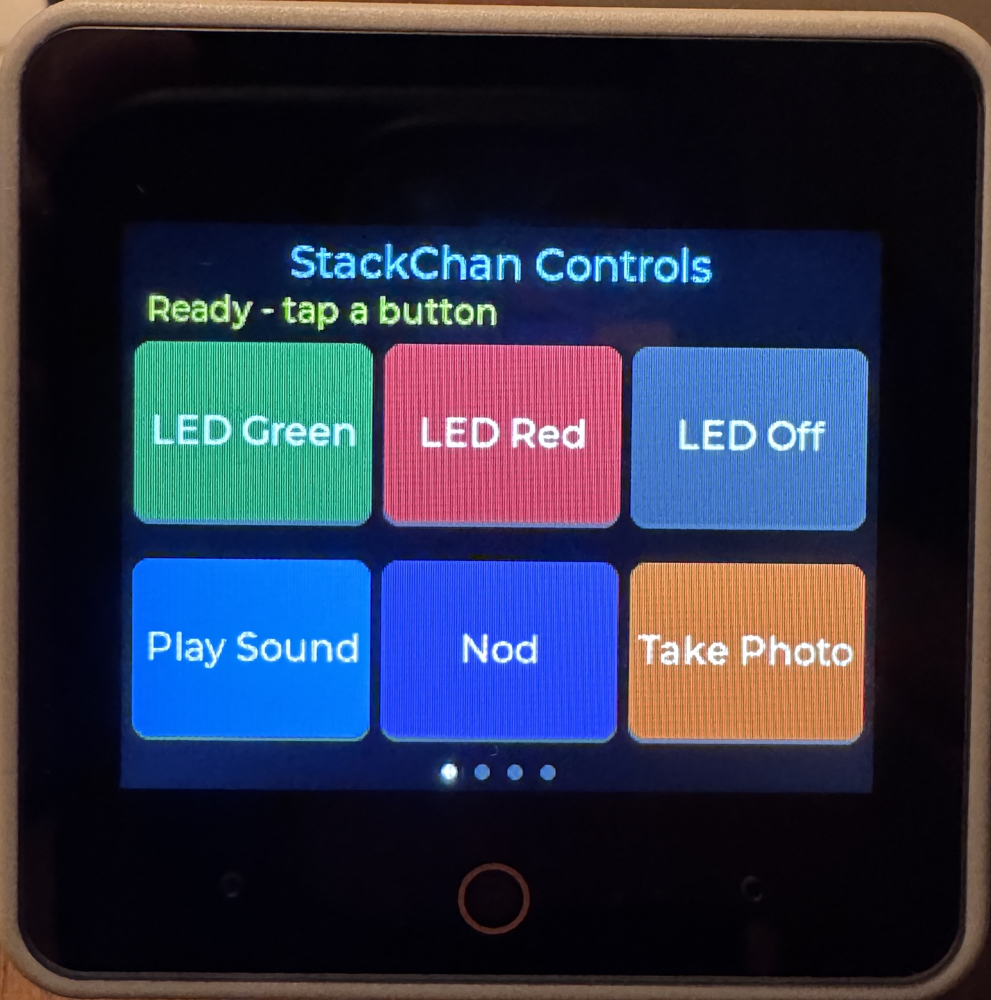
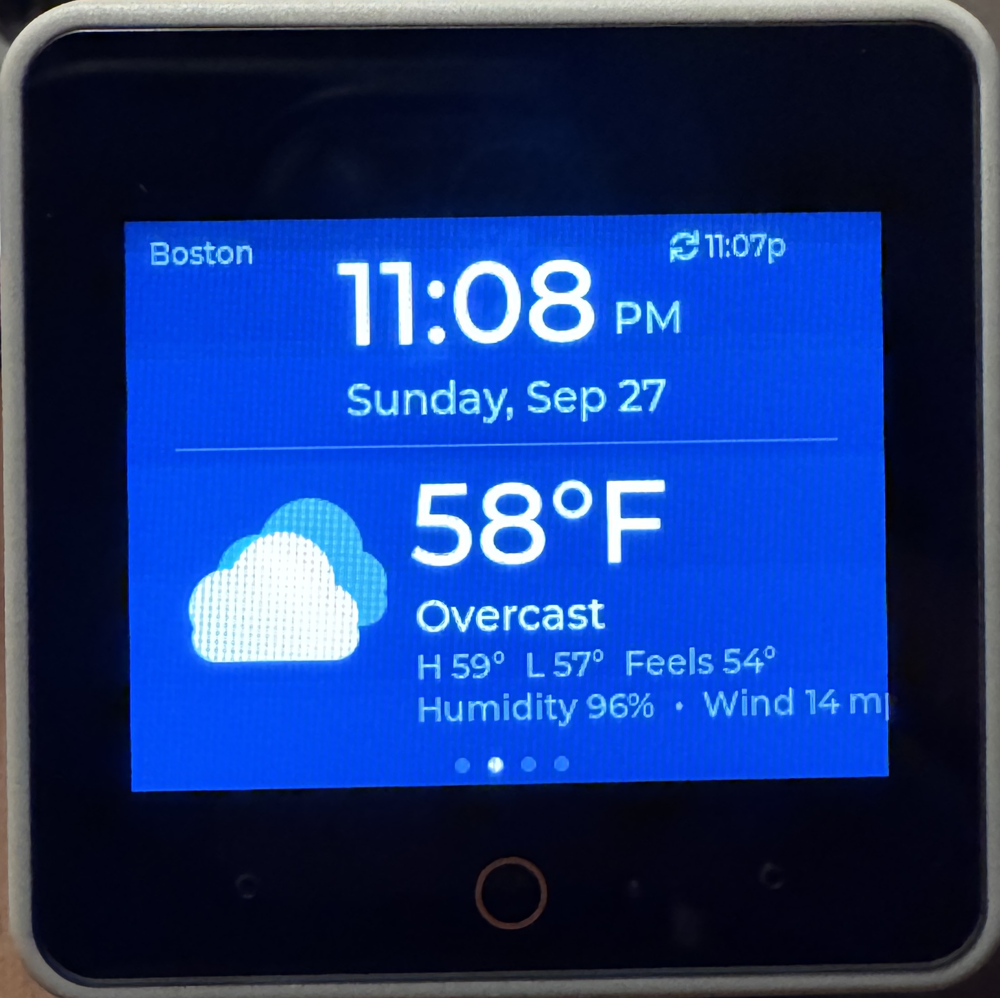
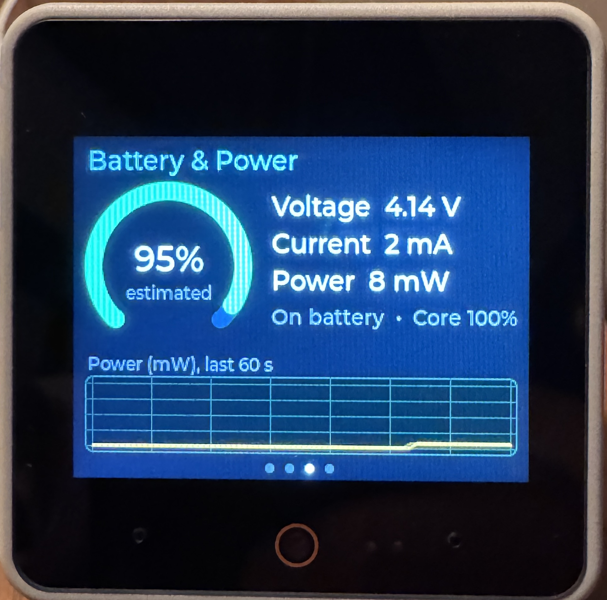
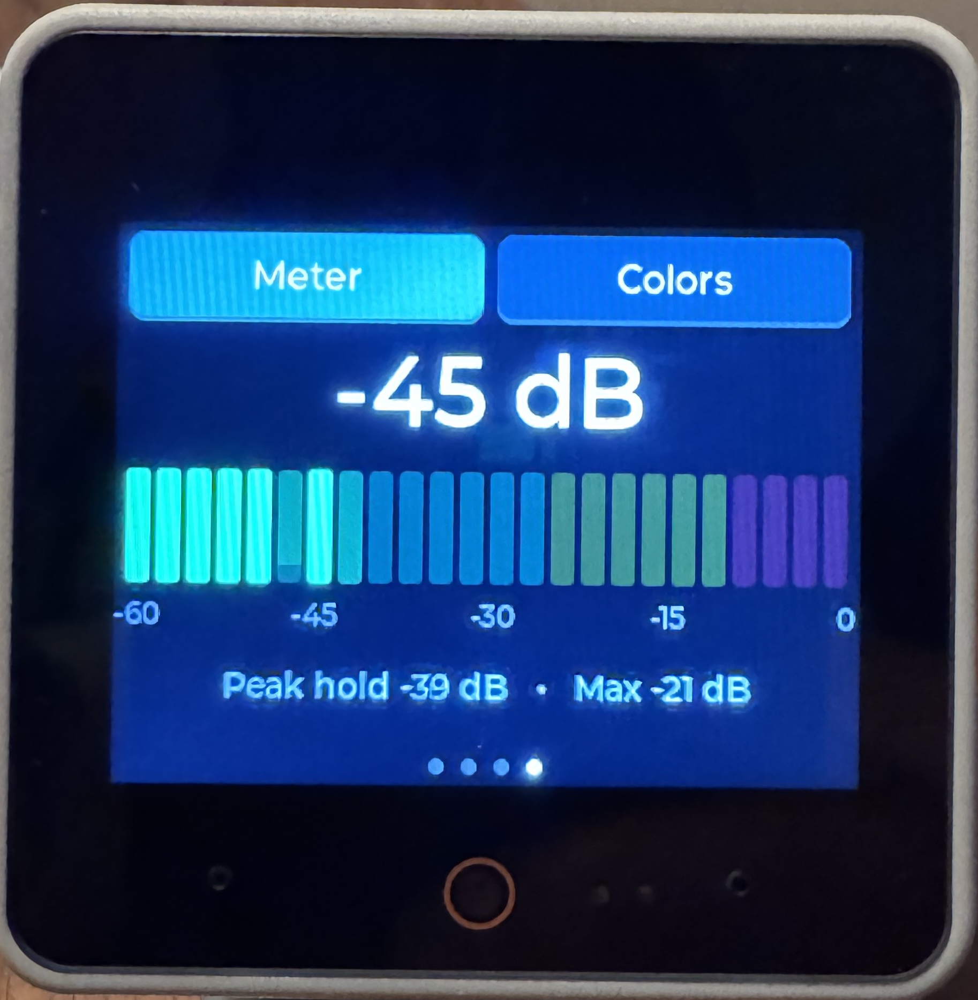
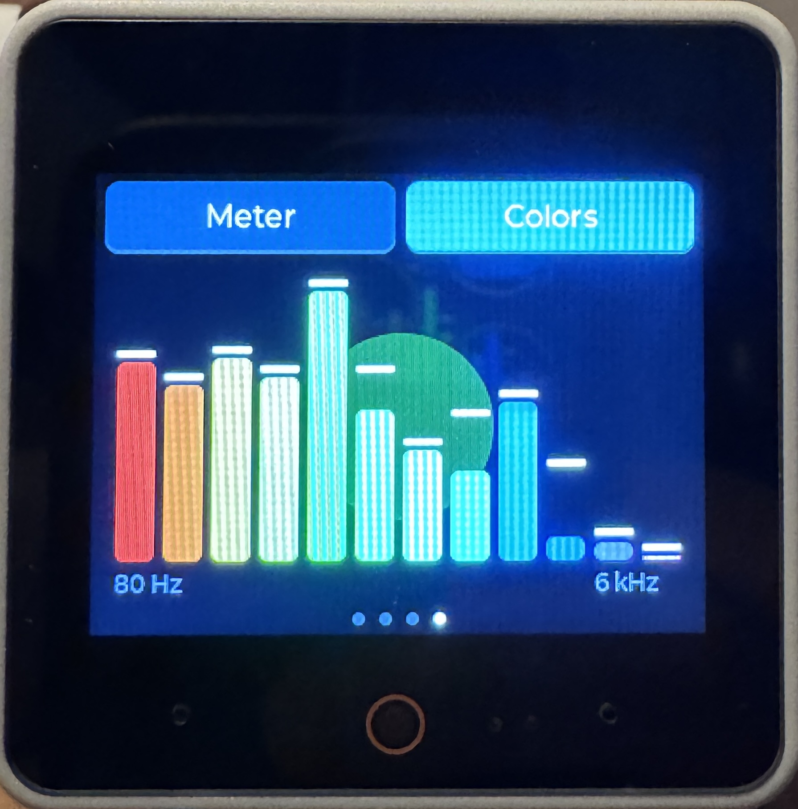

# Kitchen Sink Demo

**Kitchen Sink Demo** is a swipeable, multi-screen app for the M5Stack **StackChan**, written in MicroPython for **UIFlow2.0** with `m5ui` (LVGL 9).

Swipe **left** for the next app and **right** for the previous one. It wraps around at both ends. Dots at the bottom of the screen show which app you're on.

| # | App | What it does |
|---|-----|--------------|
| 1 | **Controls** | Six buttons: LED Green, LED Red, LED Off, Play Sound, Nod, and Take Photo (shown for 5 s) |
| 2 | **Clock + Weather** | Large clock and date, plus current conditions with drawn weather icons: temperature, high/low, feels-like, humidity, and wind |
| 3 | **Battery** | Charge gauge (estimated from voltage), voltage, current, power, charging status, and a 60-second power graph |
| 4 | **Audio** | Live microphone visuals with two modes chosen from buttons along the top: **Meter** and **Colors** |

---

## Screen Shots

* Controls
  
* Clock
  
* Battery
  
* Audio
  
  

## Tested on

| | |
|---|---|
| **Device** | M5Stack StackChan (CoreS3-based: ESP32-S3, 320×240 touchscreen, camera, microphone, speaker) with the StackChan robot body (pan/tilt servos, 12 RGB LEDs, INA226 battery monitor) |
| **Firmware** | UIFlow2.0 for StackChan v2.5.3, flashed with M5Burner |
| **IDE** | UiFlow2 web IDE ([uiflow2.m5stack.com](https://uiflow2.m5stack.com)), Python code view |

Kitchen Sink Demo uses the StackChan-specific `hardware.stackchan` driver, so it won't run unchanged on a plain CoreS3 without the StackChan body.

## Requirements

- StackChan flashed with **UIFlow2.0 for StackChan** (tested against the 2.5.x API)
- Wi-Fi configured in UIFlow2, which the clock and weather need. Controls works offline.
- No API keys. Weather comes from [Open-Meteo](https://open-meteo.com/), which is free and needs no signup.

## Run it

1. Open [uiflow2.m5stack.com](https://uiflow2.m5stack.com) and connect to your StackChan.
2. Create a new project, switch to the **Python** code view, and paste in all of `kitchen-sink-demo.py`.
3. Edit the **CONFIG** section at the top (see below).
4. Click **Run Once** to test. Click **Download** to make it the program that runs at boot.

## Configuration

All settings are in the `CONFIG` block at the top of the file.

| Setting | Default | Notes |
|---|---|---|
| `HOME_Y` | `20` | Tilt angle at which **your** head looks upright. Set it to the value you measured. |
| `NOD_AMOUNT` / `NOD_MOVE_MS` | `15` / `300` | Nod size in degrees and speed per leg in ms. |
| `Y_MIN` / `Y_MAX` | `5` / `85` | Safe tilt limits. Don't widen them. |
| `VOLUME` | `0.6` | Speaker volume, from 0.0 to 1.0. |
| `PHOTO_SHOW_MS` | `5000` | How long the photo stays on screen. |
| `CITY_NAME`, `LATITUDE`, `LONGITUDE` | Boston | Location used for the weather. |
| `USE_24H` | `False` | Use a 24-hour clock instead of 12-hour with AM/PM. |
| `TEMP_UNIT` / `WIND_UNIT` | `fahrenheit` / `mph` | `celsius`; `kmh`, `ms`, `kn` |
| `WEATHER_REFRESH_MS` | 15 min | How often the weather updates. |
| `BATTERY_UPDATE_MS` | `1000` | How often the battery screen refreshes. |
| `POWER_HISTORY_POINTS` | `60` | Number of points in the power graph (one per update). |
| `AUDIO_RATE` / `AUDIO_CHUNK` | `16000` / `512` | Mic sample rate, and samples per frame (32 ms). |
| `MIC_GAIN_DB` | `0` | Offset added to the meter reading. Raise it if the meter reads low. |
| `METER_FLOOR_DB` | `-60` | Quietest level shown on the meter. |
| `AUDIO_MIN_FRAME_MS` | `(0, 60)` | Minimum time between redraws for Meter and Colors. |
| `SPECTRUM_LOW_HZ` / `SPECTRUM_HIGH_HZ` | `80` / `6000` | Frequency range of the 12 color bars. |
| `SPECTRUM_RANGE` | `3.5` | Dynamic range of the bars. Lower it for more movement, raise it for less. |
| `SPECTRUM_MIN_REF` | `9.5` | Noise gate for the bars. Raise it if they dance in a quiet room. |
| `LED_BRIGHTNESS` | `0.5` | Brightness of the LEDs in Colors mode. |
| `SWIPE_ANIM_MS` | `250` | Length of the slide animation between apps. |

---

## How it's built

```
AppManager                      owns hardware, pages, swipe navigation, main loop
 ├─ ControlsApp(App)            app 1
 ├─ ClockWeatherApp(App)        app 2
 ├─ BatteryApp(App)             app 3
 ├─ AudioApp(App)               app 4
 └─ ...your apps(App)           add to the APPS list
```

### The `App` base class

Each screen is a class that extends `App`. The manager calls these methods:

| Method | When | Use it for |
|---|---|---|
| `build(page)` | Once, at startup | Create widgets on `page` |
| `on_enter()` | Each time the app becomes visible | Start things, force a redraw |
| `tick()` | Every loop pass (~10 ms) while visible | Quick periodic work. Don't block here. |
| `on_exit()` | Each time you swipe away | Stop things, turn LEDs off |

Apps get shared resources through the manager:

- `self.sc`: the `StackChan` hardware object (servos, LEDs, touch, NFC, battery)
- `self.mgr.run_later(fn)`: runs `fn` from the main loop instead of inside an LVGL callback. Use it for anything that sleeps or blocks, such as sounds, servo moves, the camera, or network calls.

### How swipes work

Each page listens for LVGL's `GESTURE` event. The callback only records the direction in `self.nav`, and the main loop does the actual switch with `lv.screen_load_anim(... MOVE_LEFT / MOVE_RIGHT ...)`. Scrolling is turned off on every page, because a scrollable page would swallow the swipe. Buttons have `GESTURE_BUBBLE` set, so a swipe that starts on a button still reaches the page. A quick tap on a button is still a click.

### How the clock stays correct

1. On the first weather fetch, the app attempts one NTP sync, which sets the RTC to UTC.
2. Open-Meteo returns `utc_offset_seconds` for your location, including daylight saving time. Local time is calculated as `UTC + offset`, so no timezone setup is needed.
3. As a safety net, it compares its time against Open-Meteo's reported local time. If the two differ by more than 20 minutes, it corrects itself. This covers an RTC that was never set or was set to the wrong timezone.

Before the first successful fetch, the clock shows the firmware's `time.localtime()`.

### Weather icons

The icons are drawn with LVGL shapes (circles and rounded rectangles) inside a 96×96 box, so no image files need to be uploaded. The icon kinds are clear (sun, or moon at night), partly cloudy, cloudy, rain, snow, thunderstorm, and fog. Open-Meteo's WMO `weather_code` is mapped to an icon and a description in `classify_weather()`. The background gradient also changes between day and night.

### Battery app

- Voltage, current, and power come from the StackChan body's INA226 battery monitor (`get_battery_voltage/current/power()`).
- The gauge percentage is **estimated** from voltage using a typical LiPo discharge curve (`LIPO_CURVE`). Voltage drops while the servos are moving, so the reading can dip temporarily.
- The "Charging / On battery • Core NN%" line comes from the CoreS3 power manager (`Power.isCharging()` / `Power.getBatteryLevel()`). It's left blank if your firmware doesn't expose those functions.
- The graph shows the absolute power draw over the last 60 s and rescales itself automatically.

### Audio app

The **CoreS3 microphone and speaker share one I2S bus**, so they can't run at the same time. The Audio app calls `Speaker.end()` + `Mic.begin()` in `on_enter()` and `Mic.end()` + `Speaker.begin()` in `on_exit()`. Any future app that uses the mic should follow the same pattern.

Recording uses two buffers in turn. `Mic.record()` fills one buffer in the background while the app draws the previous one.

**Frame pacing.** Drawing can take longer than the 32 ms it takes to fill a mic buffer. If the app redrew every buffer, the loop would spend all its time drawing, and touches and swipes would be missed. So after each redraw, the app waits at least `AUDIO_MIN_FRAME_MS` for that mode, and at least as long as the redraw took, before drawing again. The mic keeps recording the whole time. The mode buttons react on **press** rather than click, so a tap registers even while the loop is busy.

An oscilloscope mode was tried and removed. Redrawing a full LVGL line chart many times a second was too slow on this hardware and made the app unresponsive.

| Mode | How it works |
|---|---|
| **Meter** | RMS level in dBFS (DC offset removed). It drives 24 LED-style segments (green, yellow, red) with a slowly falling peak-hold marker, plus a large dB readout and the session max. |
| **Colors** | 12 frequency bands (80 Hz–6 kHz, log-spaced), computed with the Goertzel algorithm. The rainbow bars have falling peak caps, and a glow circle behind them pulses with loudness and cycles its color. StackChan's 12 LEDs light up to match: one LED per band, with brightness set by that band's level. |

The LEDs turn off when you switch away from Colors mode or leave the app.

---

## Adding a new app

1. Copy the **TEMPLATE** block in the file, uncomment it, and rename the class:

   ```python
   class UptimeApp(App):
       NAME = "Uptime"
       BG = 0x101820

       def build(self, page):
           self.lbl = label(page, "--", 90, 100, 0xFFFFFF, lv.font_montserrat_24)
           self.start = time.ticks_ms()
           self.last = 0

       def tick(self):
           secs = time.ticks_diff(time.ticks_ms(), self.start) // 1000
           if secs != self.last:
               self.last = secs
               self.lbl.set_text("Up %d:%02d" % (secs // 60, secs % 60))
   ```

2. Add it to `APPS`:

   ```python
   APPS = [ControlsApp, ClockWeatherApp, BatteryApp, AudioApp, UptimeApp]
   ```

That's all you need. The page dots, swipe handling, and ordering update automatically.

Some helpers you can reuse: `label(...)`, `shape(...)`, `circle(...)`, `container(...)`, `show(obj, visible)`, `hsv(h, s, v)`, `make_chart(...)` / `chart_range(...)` / `chart_set_all(...)`, `set_page_gradient(...)`, `refresh_now()`, `http_get_json(url)`, `wifi_connected()`, `clamp(...)`, and `clamp_y(angle)`.

To give an app several views, as the Audio app does, put each view in its own `container(...)` and switch between them with `show(view, True/False)`.

**Fonts available on StackChan** (m5ui/LVGL): `lv.font_montserrat_12/14/16/18/24/40/44/48`. The built-in fonts include `°`, `•`, and the `lv.SYMBOL.*` icons (for example `lv.SYMBOL.WIFI` and `lv.SYMBOL.BATTERY_FULL`).

---

## Troubleshooting

| Symptom | Fix |
|---|---|
| **Swiping does nothing** | Swipe fast and across most of the screen width, since LVGL needs a quick movement of about 50 px or more. If it still doesn't work, check the console for errors from `on_gesture`. |
| **Buttons don't come back after a photo** | In `take_photo()`, replace `self.page.invalidate()` with `lv.screen_active().invalidate()`. The photo is drawn with `M5.Lcd`, outside LVGL, so LVGL has to be told to repaint the page. |
| **"No Wi-Fi" / "Weather error"** | Check your UIFlow2 Wi-Fi settings. The network must be **2.4 GHz**. The app retries every 60 s. |
| **Time is off by whole hours** | It should correct itself after the first weather fetch. If it doesn't, make sure that fetch succeeded (the status at top right shows ↻ and a time). |
| **Clock shows `--:--`** | The RTC isn't set and no weather fetch has succeeded yet. Check Wi-Fi. |
| **The UI freezes briefly every 15 min** | That's the weather request, which blocks the loop for about 1–2 s. It only happens while the clock app is visible. |
| **The head nods down first** | Swap the `up` and `down` lines in `ControlsApp.nod()`. |
| **Audio says "Microphone unavailable"** | Check the console for the error. The mic can't start while the speaker is busy, so wait for any sound to finish before swiping to Audio. |
| **No sound in Controls after visiting Audio** | `AudioApp.on_exit()` should restore the speaker. If sound is still missing, check the console for a `Mic.end()` error. |
| **Meter barely moves** | Raise `MIC_GAIN_DB` (for example to `20`), or raise `METER_FLOOR_DB` (for example to `-50`). |
| **Color bars jump around in silence** | Raise `SPECTRUM_MIN_REF` by about 0.5 at a time. If they hardly move, lower it. |
| **Colors mode feels sticky or taps are ignored** | Raise the Colors value in `AUDIO_MIN_FRAME_MS` (for example to `100`). |
| **Power graph stays flat** | Chart function names vary between LVGL builds. `chart_set_all()` falls back to `set_next_value()` automatically; check the console for errors. |
| **Colors mode feels slow** | The Goertzel math runs in plain Python. Lower `SPECTRUM_SAMPLES` to `192` or `128`. |

## Known limitations and ideas

- Actions like the nod, sound, photo, and weather fetch **block** the loop, so swipes and taps are ignored while they run. A good next step is a small non-blocking task scheduler with `ticks_ms`-based state machines.
- The weather only updates while the clock app is visible.
- The mic and speaker can't run together, so the Audio app can't play sounds.
- The battery percentage is estimated from voltage and isn't a fuel gauge.
- Future app ideas: battery and servo power monitor, NFC mood cards, IR remote, face tracking, and a "talk to my MCP server" screen.
